#### [idea] Show initial message centered.
1. When plugin opened initially help message in all pane should be at center.
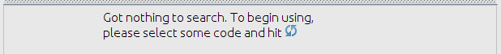  
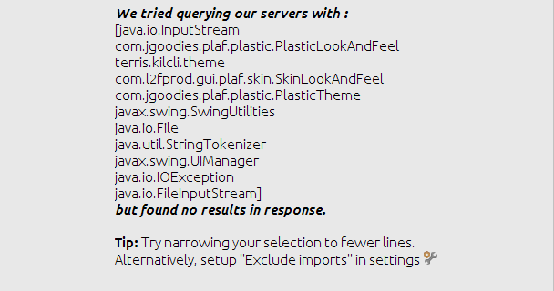  
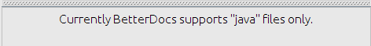  

####[idea] Introduced async fetching of results from elastic search server.
##### fixes <a href='https://github.com/Imaginea/BetterDocs/issues/131'> #131 </a>
##### fixes <a href='https://github.com/Imaginea/BetterDocs/issues/127'> #127 </a>
1. While fetching results IDE should not hang.

#### [ideaplugin] show help info should autmatically bring the focus to main pane.
##### Display the content centered.
1. When help message is displayed all pane should get focus and help content should be in 			center.

#### [ideaplugin] #141 Plugin throwing AIOBE has been fixed.
##### fixes <a href='https://github.com/Imaginea/BetterDocs/issues/141'> #141 </a>
1. Add this line 'import ' in your code and hit refresh buttion.
2. NullPointerException will not be thrown.

#### [ideaplugin] fixed the white background if highlighted code in new tab in main editor  is selected
##### fixes <a href='https://github.com/Imaginea/BetterDocs/issues/117'> #117 </a>
1. When results in all pane/featured pane opened as new tab in IDE, selecting highlighted code 
	should be visible.
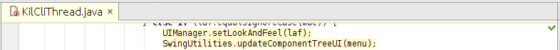  
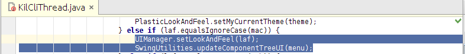  

#### [ideaplugin] added git icon to tree nodes and goto github right click menu item
##### fixes <a href='https://github.com/Imaginea/BetterDocs/issues/129'> #129 </a>
1. All Pane project tree non leaf nodes should have git icon.
2. All Pane project tree nodes right click "Go to Github" should have git icon.
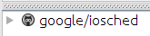  
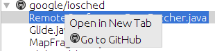  

#### [ideaplugin]fixed editor window scroll
##### fixes <a href='https://github.com/Imaginea/BetterDocs/issues/124'> #124 </a>
1. All Pane preview editor should be scrollable. 
2. 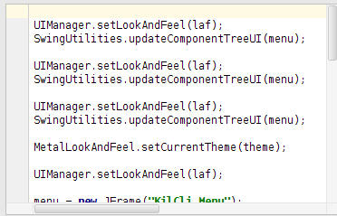

#### [ideaplugin] removed foldings from main pane editor
##### modified wrong esURL message
##### disposed tiny editors in code pane after usage
##### fixes <a href='https://github.com/Imaginea/BetterDocs/issues/112'> #112 </a>
1. All Pane preview editor should not have code foldings
2. No 'Editor has not been released..' Exception after closing the plugin. 
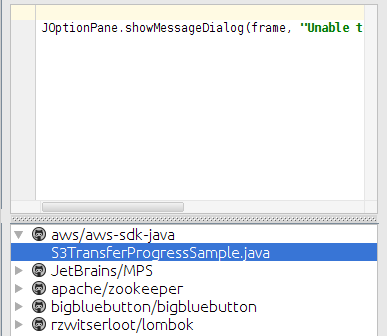 

#### [ideaplugin] Right click and open files in a tab. + Expand to full source in a tab.
##### fixes <a href='https://github.com/Imaginea/BetterDocs/issues/56'> #56 </a>
##### made files in editor readonly
##### added for jtree selection update preview pane, rightclick open in new tab
1. Right clicking project tree leaf nodes should have menu item as "Open in new tab" and clicking that should open file in new tab in IDE.
2. Opened file should be non editable.
3. Selecting leaf node in project tree should load it's preview in all pane preview editor. 
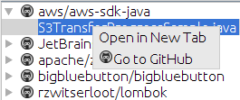  
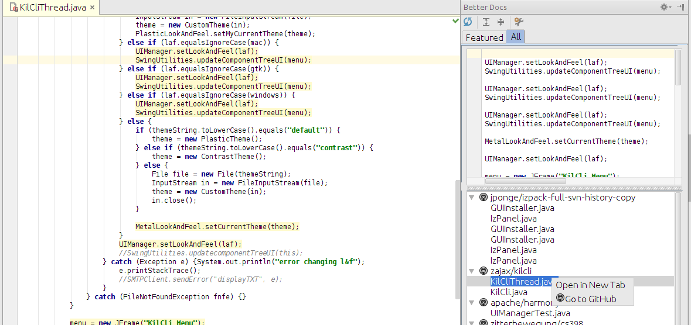  
  

#### [ideaplugin] Ignored case while searching for import names in the selected text region.
##### fixes <a href='https://github.com/Imaginea/BetterDocs/issues/114'> #114 </a>
1. Covered in ExtractImportsInLinesSuite test. 
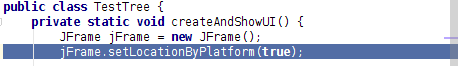
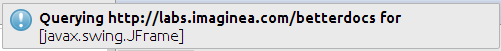

#### [ideaplugin] Registered window editor with disposer to release after it's usage.
##### fixes <a href='https://github.com/Imaginea/BetterDocs/issues/67'> #67 </a>
1. No 'Editor has not been released..' Exception after closing the plugin in idea.log/console.
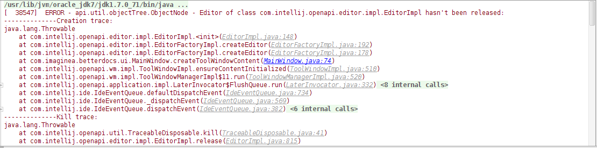 

#### [ideaplugin] Taking number of tiny editors in featured pane through settings panel.
##### fixes <a href='https://github.com/Imaginea/BetterDocs/issues/174'> #174 </a>
1. Click on settings in toolbar. This should open Settings panel.
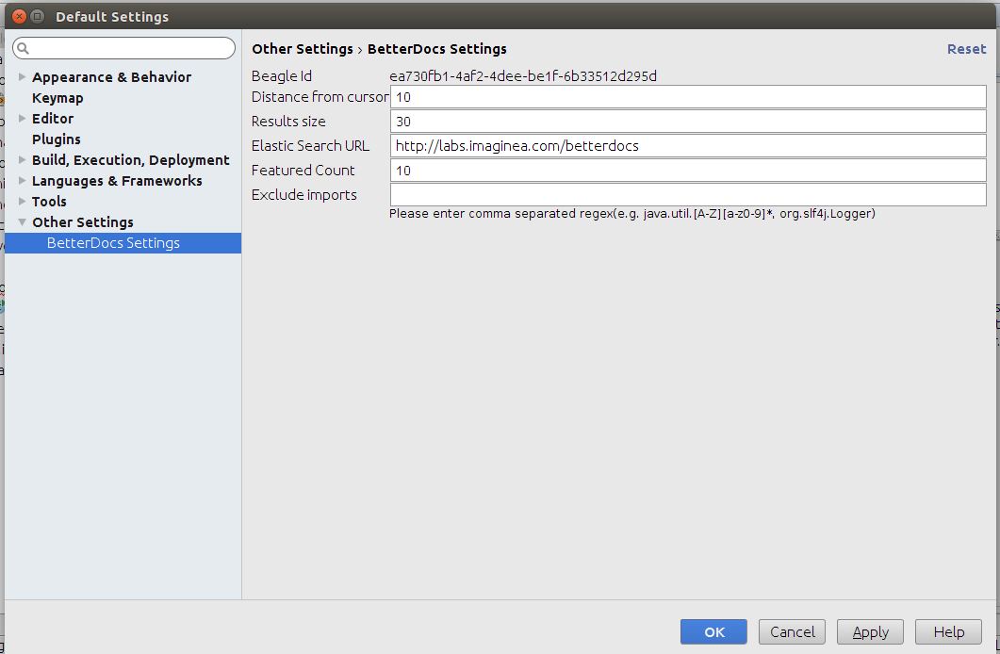
2. Change Featured Count to 10 and click on 'Apply' button followed by 'Ok' button
3. Hit refresh button.
4. In Featured Pane atmost 10 tiny editors should get populated.

#### [ideaplugin] Tabbed UI alterations.
##### fixes <a href='https://github.com/Imaginea/BetterDocs/issues/150'> #150 </a>
1. Open the Betterdocs plugin, it should have two panes named Featured and all from left to right.
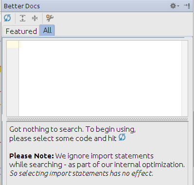
2. Hit refresh button to check search results in both panes.

#### [ideaplugin] Plugin throwing exception if HTTP response code from elastic search is not 200.
##### fixes <a href='https://github.com/Imaginea/BetterDocs/issues/139'> #139 </a>
1. Open Settings Panel, change 'Elastic Search URL' to labs.imaginea.com.
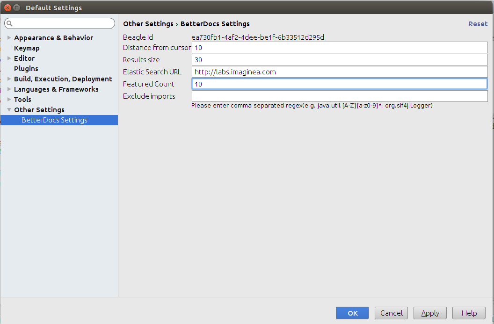
2. Apply and click 'Ok'.
3. Hit refresh button.
4. All Pane Should have message "Connection Error: 404 Not Found".
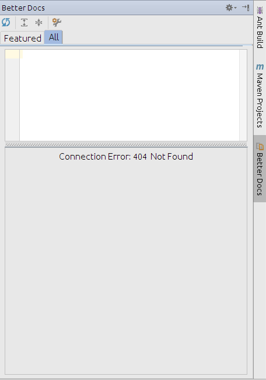
5. No Exception after closing the plugin in idea.log/console.

#### [ideaplugin] Rename "Repo Stars" in Code Pane to "Score:" and make "Repo Name" clickable.
##### fixes <a href='https://github.com/Imaginea/BetterDocs/issues/151'> #151 </a>
1. Open Betterdocs plugin, select code and hit refresh action.
2. Check the featured pane tiny editors header, clicking on the project name should open project repo in github.com.
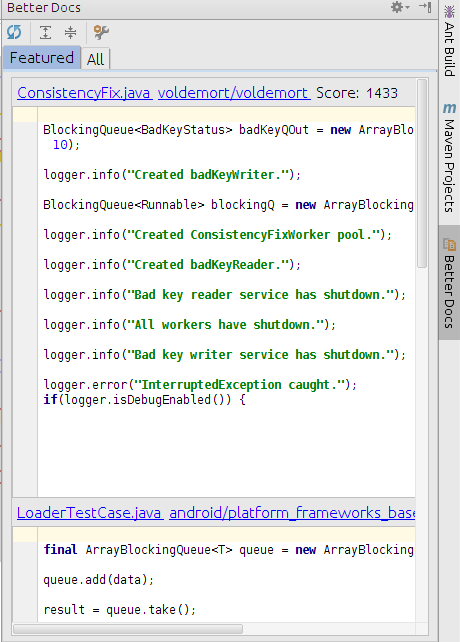

#### [ideaplugin] Expire notification bubble in 3 or 4 seconds.
##### fixes <a href='https://github.com/Imaginea/BetterDocs/issues/157'> #157 </a>
1. Open Betterdocs plugin, select code and hit refresh action.
2. If ES Result returns no results notification should expire.
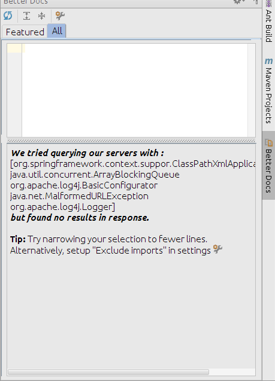

#### [ideaplugin] NPE while using the plugin.
##### fixes <a href='https://github.com/Imaginea/BetterDocs/issues/135'> #135 </a>
1. Open Betterdocs plugin, select code from any non java file and hit refresh action.
2. No NullPointerException after closing the plugin in idea.log/console.